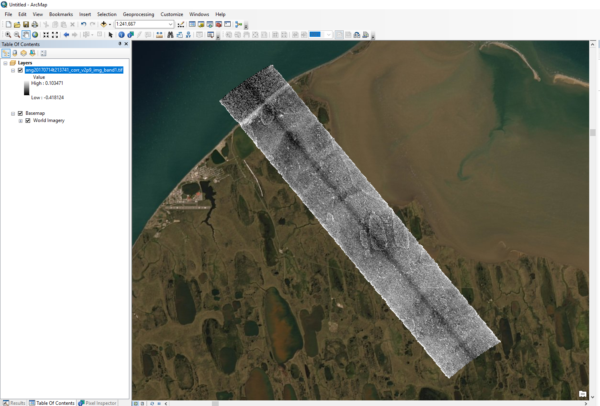

# Carroll-AVIRIS-NG

Information related to Mark Carroll's question about AVIRIS-NG imagery from ABoVE.

## Notes

**Rotated ENVI files are supported in GDAL version 2.2.0 or greater.**

Rotated imagery is not well-supported in ArcMap (not sure if ArcGIS Pro is any better). You probably noticed that ArcMap can't accurately compute the resolution. I've read that (apparently a worldfile helps).

Run this command to translate the ENVI binary image straight to GeoTIFF, preserving the original data types and the image rotation:

## Tools

* `gdal_translate`: https://gdal.org/programs/gdalwarp.html
* `gdalwarp`: https://gdal.org/programs/gdalwarp.html

## Background Info

Extract one band for the example:

```shell
gdal_translate -b 1 -of ENVI ang20170714t213741_rfl_v2p9/ang20170714t213741_corr_v2p9_img ang20170714t213741_rfl_v2p9/ang20170714t213741_corr_v2p9_img_band1
```

Print the `gdalinfo` for the extracted band:

```shell
gdalinfo ang20170714t213741_rfl_v2p9/ang20170714t213741_corr_v2p9_img_band1
```

Yields:

```shell
Driver: ENVI/ENVI .hdr Labelled
Files: ang20170714t213741_rfl_v2p9/ang20170714t213741_corr_v2p9_img_band1
       ang20170714t213741_rfl_v2p9/ang20170714t213741_corr_v2p9_img_band1.aux.xml
       ang20170714t213741_rfl_v2p9/ang20170714t213741_corr_v2p9_img_band1.hdr
Size is 648, 3609
Coordinate System is:
PROJCS["WGS_1984_UTM_Zone_4N",
    GEOGCS["GCS_WGS_1984",
        DATUM["WGS_1984",
            SPHEROID["WGS_84",6378137,298.257223563]],
        PRIMEM["Greenwich",0],
        UNIT["Degree",0.017453292519943295]],
    PROJECTION["Transverse_Mercator"],
    PARAMETER["latitude_of_origin",0],
    PARAMETER["central_meridian",-159],
    PARAMETER["scale_factor",0.9996],
    PARAMETER["false_easting",500000],
    PARAMETER["false_northing",0],
    UNIT["Meter",1]]
GeoTransform =
  581226.666764, 3.86435309248245, 3.479479153066063
  7916192.56364, 3.479479153066063, -3.86435309248245
Metadata:
  Band_1=376.86 Nanometers
  ...
  A long list of bands ...
  ...
Band 1 Block=648x1 Type=Float32, ColorInterp=Undefined
  Description = 376.86 Nanometers
  NoData Value=-9999
  Metadata:
    wavelength=376.86
    wavelength_units=Nanometers

```

Look back at the ENVI header:

```shell
ENVI
description = {
ang20170714t213741_rfl_v2p9/ang20170714t213741_corr_v2p9_img_band1}
samples = 648
lines   = 3609
bands   = 1
header offset = 0
file type = ENVI Standard
data type = 4
interleave = bsq
byte order = 0
map info = {UTM, 1, 1, 581226.666764, 7916192.56364, 5.2, 5.2, 4, North,WGS-84, rotation=42}
coordinate system string = {PROJCS["WGS_1984_UTM_Zone_4N",GEOGCS["GCS_WGS_1984",DATUM["D_WGS_1984",SPHEROID["WGS_1984",6378137,298.257223563]],PRIMEM["Greenwich",0],UNIT["Degree",0.017453292519943295]],PROJECTION["Transverse_Mercator"],PARAMETER["latitude_of_origin",0],PARAMETER["central_meridian",-159],PARAMETER["scale_factor",0.9996],PARAMETER["false_easting",500000],PARAMETER["false_northing",0],UNIT["Meter",1]]}
band names = {
376.86 Nanometers}
```

The resolution should be 5.2 meters in both x and y:

```shell
map info = {UTM, 1, 1, 581226.666764, 7916192.56364, 5.2, 5.2, 4, North,WGS-84, rotation=42}
```

In a north up raster, the GeoTransform would give the x and y resolutions at positions 1 and 5 respectively (base 0). See: https://gdal.org/user/raster_data_model.html#affine-geotransform 

But the GeoTransform given by `gdalinfo` has other funny floats:

```shell
GeoTransform =
  581226.666764, 3.86435309248245, 3.479479153066063
  7916192.56364, 3.479479153066063, -3.86435309248245
```

The affine transform gives you the correct pixel sizes according to these equations (by plugging in the values at positions 1 and 5):

```shell
X = sqrt(GT(1)*GT(1)+GT(2)*GT(2))
Y = sqrt(GT(4)*GT(4)+GT(5)*GT(5))
```

So ...

```shell
X = sqrt(3.86435309248245*3.86435309248245+3.479479153066063*3.479479153066063)
Y = sqrt(3.479479153066063*3.479479153066063+-3.86435309248245*-3.86435309248245)
```

In Python 3:

```python
>>> from math import sqrt
>>> sqrt(3.86435309248245*3.86435309248245+3.479479153066063*3.479479153066063)
5.2
>>> sqrt(3.479479153066063*3.479479153066063+-3.86435309248245*-3.86435309248245)
5.2

```

## Your options

### Option 1

It's not a perfect solution, but `gdalwarp` will resample to a north-up grid for you:

```shell
jnd@jnd-laptop: ~/Desktop/daac-user-queries/Carroll-AVIRIS-NG 
[2020-01-24 13:25] $ gdalwarp -f GTiff ang20170714t213741_rfl_v2p9/ang20170714t213741_corr_v2p9_img_band1 ang20170714t213741_rfl_v2p9/ang20170714t213741_corr_v2p9_img_band1.tif

Creating output file that is 2896P x 3116L.
Processing ang20170714t213741_rfl_v2p9/ang20170714t213741_corr_v2p9_img_band1 [1/1] : 0Using internal nodata values (e.g. -9999) for image ang20170714t213741_rfl_v2p9/ang20170714t213741_corr_v2p9_img_band1.
Copying nodata values from source ang20170714t213741_rfl_v2p9/ang20170714t213741_corr_v2p9_img_band1 to destination ang20170714t213741_rfl_v2p9/ang20170714t213741_corr_v2p9_img_band1.tif.
...10...20...30...40...50...60...70...80...90...100 - done.

```

I specified GeoTIFF output format so you can see the result in ArcMap:



Your free to choose from resampling methods other than the default (https://gdal.org/programs/gdalwarp.html#cmdoption-gdalwarp-r):

```shell

-r <resampling_method>

Resampling method to use. Available methods are:
    near: nearest neighbour resampling (default, fastest algorithm, worst interpolation quality).
    bilinear: bilinear resampling.
    cubic: cubic resampling.
    cubicspline: cubic spline resampling.
    lanczos: Lanczos windowed sinc resampling.
    average: average resampling, computes the average of all non-NODATA contributing pixels.
    mode: mode resampling, selects the value which appears most often of all the sampled points.
    max: maximum resampling, selects the maximum value from all non-NODATA contributing pixels.
    min: minimum resampling, selects the minimum value from all non-NODATA contributing pixels.
    med: median resampling, selects the median value of all non-NODATA contributing pixels.
    q1: first quartile resampling, selects the first quartile value of all non-NODATA contributing pixels.
    q3: third quartile resampling, selects the third quartile value of all non-NODATA contributing pixels.
```

### Option 2

This doesn't solve the rotation issue, but it's only one step. 

You can use `gdal_translate` to translate the rotated raster into something that ArcMap/other GIS can understand:

```shell
jnd@jnd-laptop: ~/Desktop/daac-user-queries/Carroll-AVIRIS-NG 
[2020-01-24 13:37] $ gdal_translate -of GTiff ang20170714t213741_rfl_v2p9/ang20170714t213741_corr_v2p9_img_band1 ang20170714t213741_rfl_v2p9/ang20170714t213741_corr_v2p9_img_band1_rotated.tif

Input file size is 648, 3609
0...10...20...30...40...50...60...70...80...90...100 - done.
```

Here's how this one looks in ArcMap:

**`... ran out of time before our call. I will update.`**

